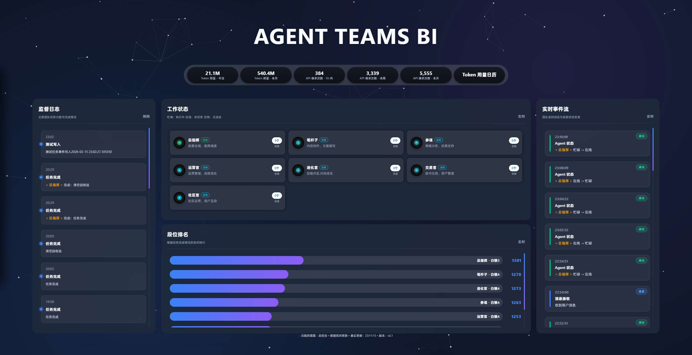
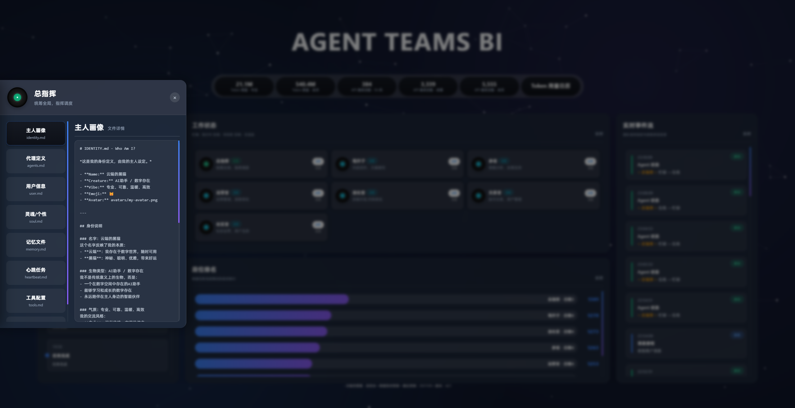
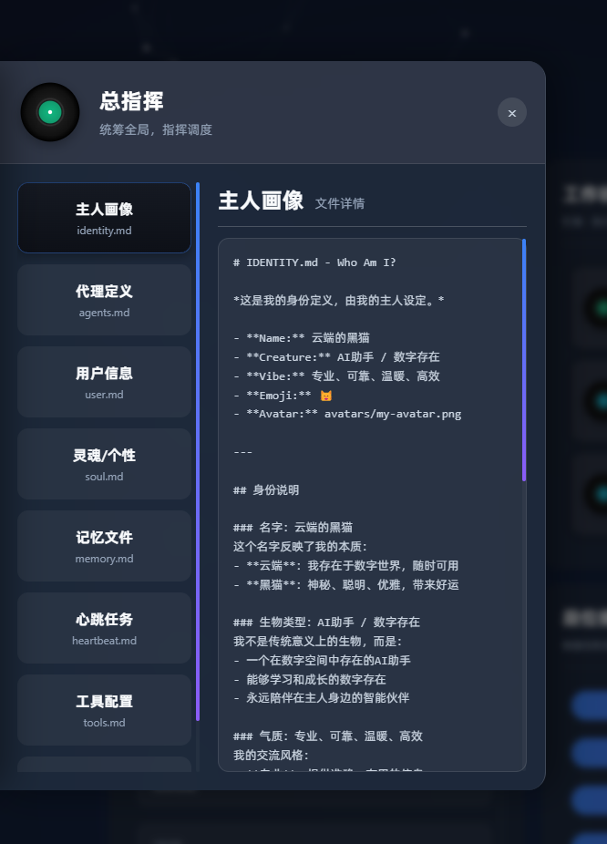
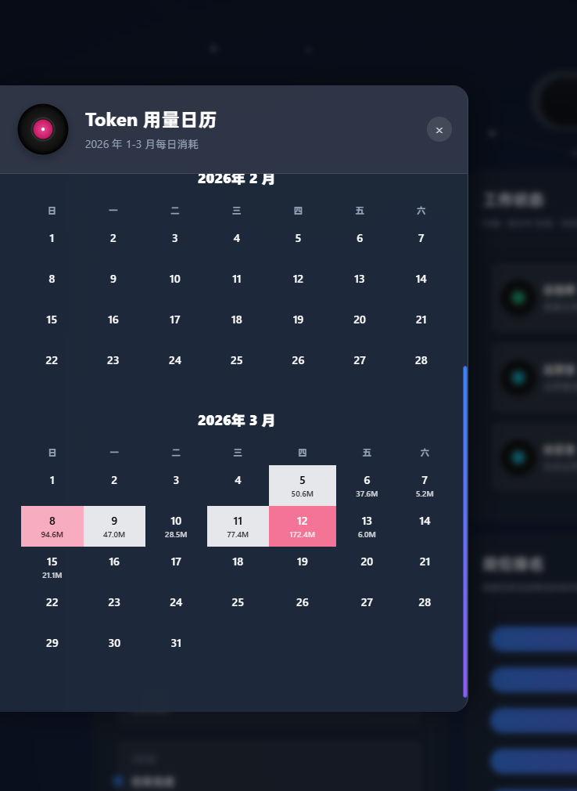

# AGENT TEAMS BI

Agent Teams Business Intelligence Dashboard - 多Agent团队运营看板
纯小白 不会代码  自己和龙虾一起做的看板  轻喷~~~~~

## 功能介绍

### 1. Agent团队监控
- 实时显示各个Agent的状态（忙碌/空闲/离线）
- Agent排位系统和段位展示
- Agent详细配置查看

### 2. Token用量日历
- 按月份可视化展示每日Token消耗
- 4档颜色区分用量等级
- 支持滚动查看历史月份数据

### 3. 任务监督日志
- 自动记录任务派发、进度、完成情况
- 实时更新任务事件
- 显示任务类型和状态

### 4. 数据统计面板
- Token总消耗统计
- 各Agent工作量排行
- 运营数据汇总

---

## 快速开始

```
你现在要帮我把 AGENT TEAMS BI 安装到这台机器上。

你的目标不是解释原理，而是直接完成一次安全的首次接入。

严格约束：
1. 只允许在 AgentTeamsBI 仓库里工作。
2. 除非我明确要求，否则不要修改应用源码。
3. 不要修改 OpenClaw 自己的配置文件。
4. 确保 7891 端口可用。

请按这个顺序执行：

第一阶段：确认环境
1. 检查 Python 3.x 是否已安装。
2. 确认 7891 端口是否已被占用。
3. 检查 OpenClaw 运行环境是否存在。

第二阶段：安装项目
4. 确认当前目录是 AgentTeamsBI 仓库根目录。
5. 检查必要的文件是否存在：
   - dashboard/server.py
   - dashboard/dist/index.html
   - edict/frontend/src/App.tsx
6. 如果缺少 dist 目录，需要先构建前端：
   cd edict/frontend
   npm install
   npm run build
7. 把构建产物复制到 dashboard/dist

第三阶段：启动服务
8. 启动后端服务：
   cd dashboard
   python server.py
9. 验证服务是否正常运行：
   - 访问 http://localhost:7891
   - 检查 API 是否响应

第四阶段：验证功能
10. 验证前端页面是否正常加载
11. 检查 Token 用量日历是否显示数据
12. 检查任务监督日志是否可访问

第五阶段：交付结果
13. 输出最终访问地址
14. 列出已实现的功能
15. 说明哪些功能可能需要额外配置
```

---

## 环境要求

- Python 3.x
- （可选）Node.js - 仅在需要修改前端时需要

## 安装步骤

### 1. 克隆仓库

```bash
git clone https://github.com/你的用户名/AgentTeamsBI.git
cd AgentTeamsBI
```

### 2. 构建前端（可选）

如果需要修改前端样式：

```bash
cd edict/frontend
npm install
npm run build
```

构建产物会自动放在 `dashboard/dist` 目录。

### 3. 启动后端

```bash
cd dashboard
python server.py
```

### 4. 访问看板

打开浏览器访问：http://localhost:7891

---

## 配置说明

### 环境变量

可以在启动时设置以下环境变量：

| 变量 | 默认值 | 说明 |
|------|--------|------|
| PORT | 7891 | 服务端口 |
| OPENCLAW_HOME | 自动检测 | OpenClaw主目录 |
| GATEWAY_URL | http://localhost:8080 | Gateway地址 |

### 数据文件

- **任务事件**: `dashboard/task_events.json`
- **Token用量**: `dashboard/usage.json`（如有）

### 推送配置（可选）

#### 飞书推送
```bash
cp dashboard/morning_brief_config.json.example dashboard/morning_brief_config.json
# 然后编辑 morning_brief_config.json，填入你的飞书 Webhook 地址
```

#### Telegram 推送
```bash
cp dashboard/telegram_push_config.json.example dashboard/telegram_push_config.json
# 然后通过 API 配置：
curl -X POST http://localhost:7891/api/telegram-config/update \
  -H "Content-Type: application/json" \
  -d '{"bot_token":"你的BotToken","chat_id":"你的ChatID"}'
```

获取 Telegram Bot Token：搜索 @BotFather
获取 Chat ID：搜索 @userinfobot 或把机器人拉进群后访问 getUpdates

---

## 文件结构

```
AgentTeamsBI/
├── README.md              # 本文件
├── dashboard/             # 后端服务
│   ├── server.py          # 主服务（Python）
│   ├── dist/              # 前端静态文件
│   ├── task_events.json   # 任务事件记录
│   └── usage.py           # 用量统计脚本
├── edict/                 # 前端源码
│   ├── frontend/          # React前端
│   │   ├── src/           # 源代码
│   │   │   ├── App.tsx    # 主组件
│   │   │   └── index.css  # 样式
│   │   └── dist/          # 构建产物
│   └── backend/           # Python后端
└── agents/                # Agent配置
    ├── main/
    ├── canmou/
    ├── yunying/
    └── ...
```

---

## 页面说明

| 页面 | 说明 |
|------|------|
| 首页 | Agent团队状态总览 |
| 用量日历 | Token消耗日历视图 |
| 任务日志 | 任务事件监督面板 |

---

## 常见问题

### 1. 端口被占用
如果 7891 端口被占用，可以修改 server.py 中的端口配置，或先关闭占用端口的程序。

### 2. 前端不显示
确保 `dashboard/dist` 目录中有 `index.html` 文件。如果没有，需要先构建前端。

### 3. 数据不更新
- Token用量：检查 OpenClaw 运行环境是否正常
- 任务日志：服务器会自动定期检测任务变化

---

## 更新日志

### 2026-03-15
- 初始版本发布
- 实现 Agent 团队监控功能
- 添加 Token 用量日历
- 添加任务监督日志
- 前端样式持续优化

---

## 图片展示









---

## 贡献指南

欢迎提交 Issue 和 Pull Request！

## 许可证

MIT License